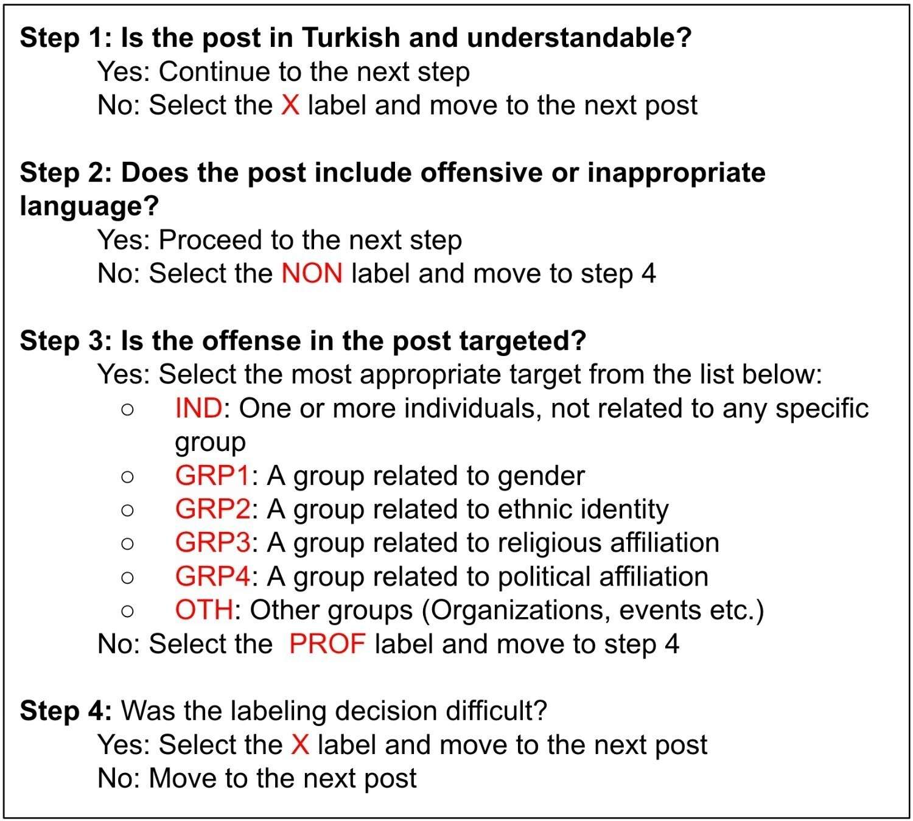
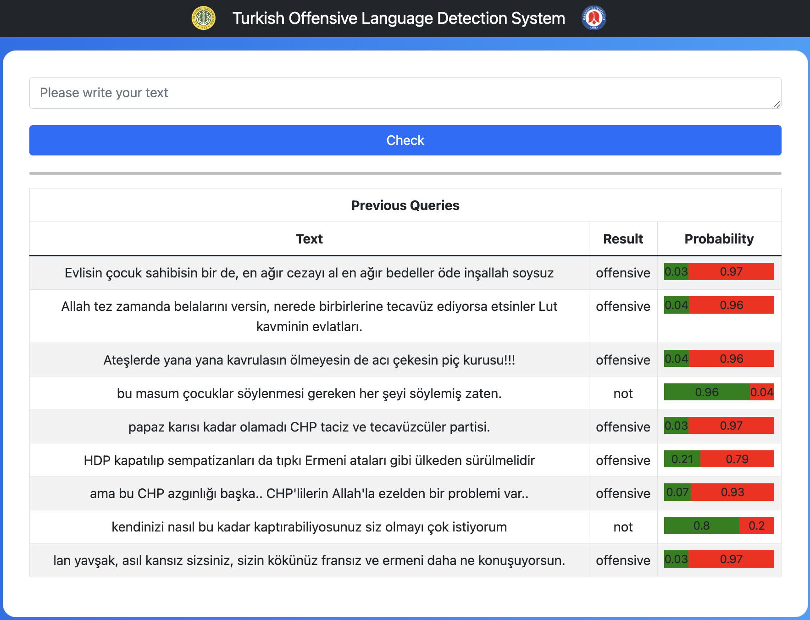

## Turkish Offensive Language Detection System
This page contains information about the dataset, web service, and web page created as part of the 'Turkish Offensive Language Detection System on Social Media' paper:
* The following annotation guidelines were followed during the creation of the Turkish Offensive Language Identification Dataset (TOLID):
  
  
  
* The web service was developed using the Flask web framework in Python:
* The web interface was developed using the Angular web framework:
     
  
    
