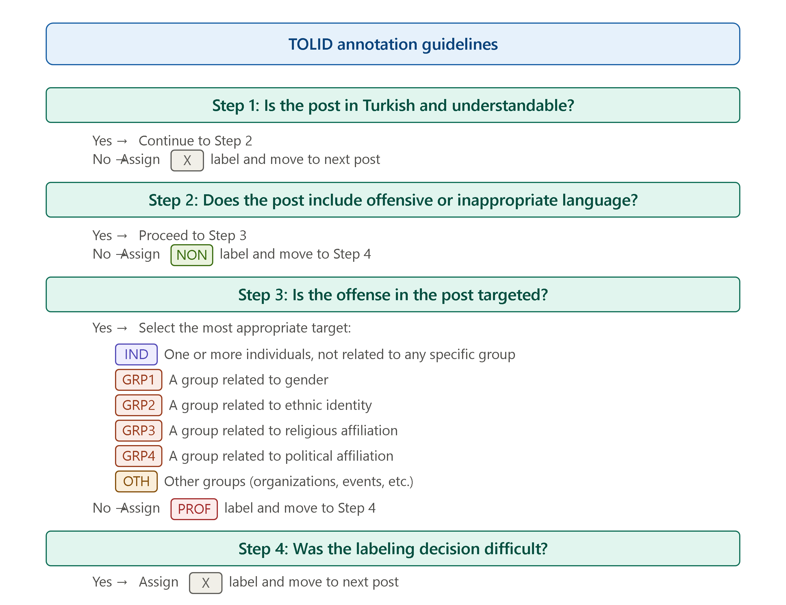
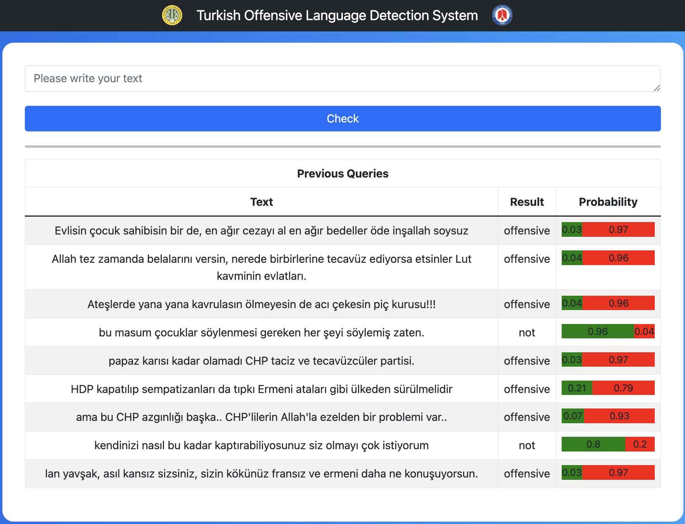

# Turkish Offensive Language Identification Dataset (TOLID)

This repository contains resources for the following paper:

> **TOLID: Turkish Offensive Language Identification Dataset and Transformer-Based Benchmarks**
> Mehmet Salih Kurt, Eylem Yücel
> *Electrica*, 26, 0404, 2026.
> DOI: [10.5152/electrica.2026.25404](https://doi.org/10.5152/electrica.2026.25404)
> Publication Date: July 24, 2026

---

## Overview

TOLID is a large-scale, high-quality dataset for the automatic detection of offensive language in Turkish social media posts. It includes **5,202 manually annotated posts** collected from X (formerly Twitter), labeled by three independent expert annotators using a hierarchical annotation scheme.

The dataset covers a wide range of offensive expressions **without imposing restrictions on topics, individuals, or groups**, and includes fine-grained subcategories such as sexist, racist, political, and religious insults.

### Label Distribution

| Label | Description | Count | % |
|-------|-------------|-------|---|
| X | Non-Turkish or unintelligible content | 149 | 2.86 |
| NON | Non-offensive content | 934 | 17.95 |
| PROF | Profanity or non-targeted offensive language | 2695 | 51.79 |
| IND | Offensive content targeting an individual | 833 | 16.02 |
| GRP1 | Gender-based hate speech | 38 | 0.73 |
| GRP2 | Ethnicity-based hate speech | 12 | 0.23 |
| GRP3 | Religion-based hate speech | 25 | 0.48 |
| GRP4 | Political affiliation-based hate speech | 157 | 3.02 |
| OTH | Other group-based hate speech | 359 | 6.90 |

---

## Annotation Guidelines

The following hierarchical annotation scheme was used during dataset construction:



---

## Models

Three transformer-based models adapted for Turkish were trained and evaluated on TOLID:

| Model | Offensive F1 (Macro) | Targeted F1 (Macro) |
|-------|----------------------|----------------------|
| BERTurk | 0.810 | 0.777 |
| ConvBERTurk | **0.827** | **0.781** |
| ELECTRA-Turkish | 0.808 | 0.780 |

ConvBERTurk achieved the best performance, outperforming all previous Turkish offensive language detection studies.

---

## Web Interface

A web-based application was developed to provide a practical interface for analyzing text and visualizing model outputs in real time.



---

## Dataset Access

The TOLID dataset is available **upon request** for academic and research purposes only.

Commercial use is strictly prohibited under the [CC BY-NC 4.0](https://creativecommons.org/licenses/by-nc/4.0/) license.

To request access, please send an email to **drsalihkurt@gmail.com** with the following information:

1. Full name
2. Institution / Affiliation
3. Intended use (brief description)
4. Confirmation that the dataset will not be used for commercial purposes

---

## Citation

If you use this dataset or the associated models in your research, please cite:

```bibtex
@article{kurt2026tolid,
  title   = {TOLID: Turkish Offensive Language Identification Dataset and Transformer-Based Benchmarks},
  author  = {Kurt, Mehmet Salih and Y{\"u}cel, Eylem},
  journal = {Electrica},
  volume  = {26},
  number  = {0404},
  year    = {2026},
  doi     = {10.5152/electrica.2026.25404}
}
```

---

## License

This dataset is released under the
[Creative Commons Attribution-NonCommercial 4.0 International (CC BY-NC 4.0)](https://creativecommons.org/licenses/by-nc/4.0/) license.

---

## Contact

**Mehmet Salih Kurt**
Assistant Professor, Department of Computer Engineering
Hakkari University Faculty of Engineering, Hakkari, Türkiye
drsalihkurt@gmail.com

**Eylem Yücel**
Associate Professor, Department of Computer Engineering
Istanbul University–Cerrahpaşa Faculty of Engineering, İstanbul, Türkiye
